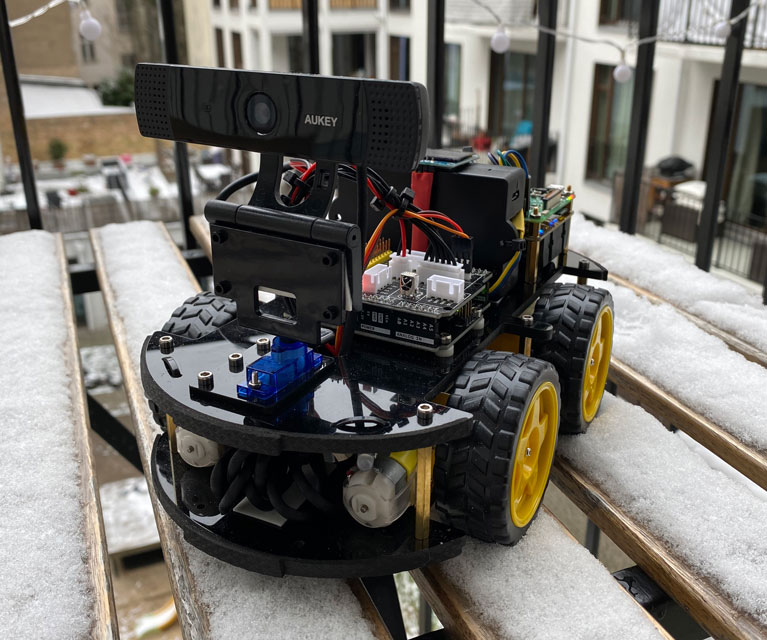

# bebop



<ins>be</ins>ep<ins>bo</ins>o<ins>p</ins> - a remotely controlled robocar. Connect it to your WiFi and let your friends drive it around the house through the power of the interwebs. Written in Javascript with some native tools doing the heavy lifting. Read the [story of how it was built](https://medium.com/@max.degterev/building-a-remotely-controlled-car-135838e2aeb7).

## Hardware
You can run this software with minor modifications on almost any Raspberry Pi based system. It relies on a combination of Arduino Uno and Raspberry Pi plus some additional IO. You can skip using some of the hardware by updating [adapters](./adapters/index.js) without removing all of the code. The software for the Arduino Uno can be found in the [board](./board/bebop) folder.

I used the following as my setup:
  - [Elegoo Car Kit v3.0 Plus - the base to build upon](https://www.elegoo.com/collections/robot-kits/products/elegoo-smart-robot-car-kit-v-3-0-plus)
  - [Raspberry Pi 3 Model B+ - the brains of the system](https://www.amazon.de/-/en/Raspberry-1373331-Pi-Model-Motherboard/dp/B07BDR5PDW)
  - [ELEGOO Revised Electronic Learning Set - wires, LEDs and a buzzer](https://www.amazon.de/gp/product/B01M7N4WB6)
  - [128x64 Pixel I2C OLED Display - to know the status of the system at a glance](https://www.amazon.de/gp/product/B074N9VLZX)
  - [Raspberry Pi UPS Power Supply - to power the Raspberry Pi](https://www.amazon.de/gp/product/B082KJJMP2)
  - [18650 Batteries - for the UPS](https://www.reichelt.de/de/de/industriezelle-li-ion-18650-3-6-v-2600-mah-button-top-xtar-18650-2600-p253361.html)
  - [USB Webcam - any old webcam will do](https://www.amazon.de/-/en/gp/product/B0721MKXQ2)
  - [MicroSD - 32GB is more than enough](https://www.amazon.de/-/en/SanDisk-Extreme-microSDHC-Rescue-Deluxe/dp/B06XWMQ81P)
  - (Optional) [Soldering Iron - to finish the build](https://www.amazon.de/-/en/gp/product/B07S6S9844)

Of course you can use any compatible parts, these are here just for reference. I stripped away the line tracking, bluetooth and ultrasonic from the car as I didn't need them. The car should be connected to the Raspberry Pi using a simple USB connection. The GPIO should be connected this way:


## How to prepare the Raspberry Pi

1. Download [Raspberry Pi Imager](https://www.raspberrypi.org/software/) and flash "Raspberry Pi OS Lite (32 Bit)" located in *Raspberry Pi OS (other)*
2. Re-plug the SD card to mount the `boot` volume and create 2 files in the root:
  - an empty `ssh` file: this will enable ssh access on boot
  - a `wpa_supplicant.conf`: this will allow your Raspberry Pi to connect to your WiFi on boot

    Example:
    ```
    ctrl_interface=DIR=/var/run/wpa_supplicant GROUP=netdev
    update_config=1
    country=DE

    network={
      ssid="My WiFi"
      psk="My WiFi password"
      id_str="mywifi"
    }
    ```
    You can add multiple network sections for multiple networks (e.g. home and office).

    *OPTIONAL:* you can also comment out in your config.txt:
    ```
    #dtoverlay=vc4-fkms-v3d
    #max_framebuffers=2
    ```
    These are not needed unless you want to attach a screen.

    *OPTIONAL:* you can add this to your config.txt

    ```
    gpu_mem=256
    ```
    This *should* improve FFMPEG performance, but I personally didn't notice any difference.

3. Turn on your Raspberry Pi and connect via ssh: `ssh pi@raspberrypi.local` with password `raspberry`, configure SSH keys and the rest of the OS as you like.   Make sure to rename your Raspberry Pi's network name to `bebop`. Otherwise edit [package.json](./package.json) and [ecosystem.config.js](./ecosystem.config.js) with your Raspberry Pi hostname/IP address. If you don't do this some of the deployment actions will fail. The rest of the documentation assumes you have your Raspberry Pi available as `bebop.local`. Reconnect the network or reboot the system for the network name change to take effect: `sudo reboot`

4. Update your system
 - Run `sudo raspi-config` and choose "8 Update"
 - Run
    ```
    sudo apt-get update -y
    sudo apt-get upgrade -y
    ```

5. Configure your hardware IO following these instructions:
  - [i2c bus - sets up display](https://github.com/fivdi/i2c-bus/blob/master/doc/raspberry-pi-i2c.md#configuring-i2c-with-raspi-config)
  - [serial - controls the Arduino Uno board](https://serialport.io/docs/guide-installation#raspberry-pi-linux)
  - [pigpio - controls the LEDs and the buzzer](https://github.com/fivdi/pigpio#step-1---install-the-pigpio-c-library)

6. Install necessary software:
  ```
  curl -sL https://deb.nodesource.com/setup_14.x | sudo -E bash -

  sudo apt-get install -y git
  sudo apt-get install -y pigpio
  sudo apt-get install -y nodejs
  sudo apt-get install -y ffmpeg
  ```

  You can check if the installation was successful like this:
  ```
  git --version
  pigpiod -v
  node -v
  npm -v
  ffmpeg --help
  ```

7. *OPTIONAL:*
  Configure NPM to have a more verbose output:
  ```
  sudo npm -g config set progress false
  sudo npm -g config set loglevel http
  ```

8. *OPTIONAL:* The onboard Raspberry Pi camera can be made available as V4L2 device by loading a kernel module: `sudo modprobe bcm2835-v4l2`. Check [this thread](https://www.raspberrypi.org/forums/viewtopic.php?t=108038) to add it on boot. If you're using USB Webcam this is not necessary, so just carry on to the next step.

9. Set up the deployment folder:
  ```
  mkdir ~/app
  ```
  Clone this repository to your development machine. Then run from the root of the repository:
  ```
  npm install
  npm run remote:setup
  npm run remote:deploy
  ```

  Later on if you only want to update some local files run `npm run remote:push`. If you want to recompile web client run `npm run remote:publish`.

10. Now back to the Raspberry Pi - setting up autostart.
  We used a module called [PM2](https://pm2.keymetrics.io) to manage deployments. However we can't use it to autostart the application. Authors of [PM2](https://pm2.keymetrics.io) refuse to allow you to run your node process with `sudo` and without it we won't get access to the hardware. Because of this we will use `systemd`. On Raspberry Pi run:
  ```
  sudo ln -s /home/pi/app/current/etc/bebop.service /etc/systemd/system/bebop.service
  sudo systemctl enable bebop.service
  sudo systemctl start bebop.service
  ```

11. *OPTIONAL:* Back up your work (Mac OS instructions):

  Fix your OS permissions by [giving Disk Utility Full Disk Access](https://www.filiotech.com/blog/apple/creating-disk-image-operation-canceled/), then shut down your Raspberry Pi, unplug the SD card and make a backup copy.
  
This is it! Power up your system and navigate your browser to [bebop.local](http://bebop.local)! You should see something like this:


Have fun!

## License

MIT © [Max Degterev](http://max.degterev.me)
